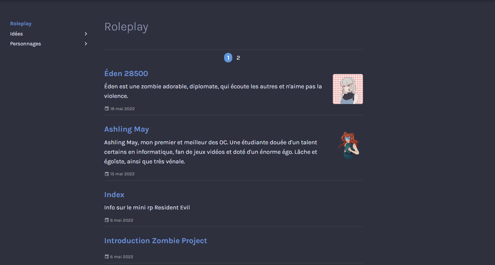

## Tags

The script will convert all `#tags` to `**tags**{: #tags .hash}` to add custom CSS to it. 
> [!example] `2022/01/01` will become `**2022/01/01**{: #2022/01 .hash}`

### Custom attribute

You can create [Inline Markdown Attribute](https://python-markdown.github.io/extensions/attr_list/) using hashtags in Obsidian. For example, to align some text to right :
1. Add 
```css
#right {
 display: inline-block;
 width: 100%;
 text-align: right;
 font-weight: normal;
}
```
2. Add `#right` on the last part of a line : 
```md
Lorem ipsum dolor sit amet, consectetur adipiscing elit. In mollis, libero porttitor gravida accumsan, justo metus pulvinar nulla, vitae dictum odio ligula non nisl. Vivamus id venenatis nulla. Nullam sed euismod ligula. Pellentesque tempor elit felis, lobortis vulputate risus gravida et. Curabitur auctor sed libero nec consectetur. Nam placerat rhoncus risus, euismod sagittis eros bibendum ac. Maecenas tellus libero, porttitor ac purus sit amet, viverra suscipit dolor. Proin id nisl velit. Ut at tincidunt libero, ac pharetra mi. Integer non luctus nisi. #right
```
It will appear as: 

**Lorem ipsum dolor sit amet, consectetur adipiscing elit. In mollis, libero porttitor gravida accumsan, justo metus pulvinar nulla, vitae dictum odio ligula non nisl. Vivamus id venenatis nulla. Nullam sed euismod ligula. Pellentesque tempor elit felis, lobortis vulputate risus gravida et. Curabitur auctor sed libero nec consectetur. Nam placerat rhoncus risus, euismod sagittis eros bibendum ac. Maecenas tellus libero, porttitor ac purus sit amet, viverra suscipit dolor. Proin id nisl velit. Ut at tincidunt libero, ac pharetra mi. Integer non luctus nisi.**{ #right}

## Folder note

You can create a folder note if you use a `category` front matter key that have the last folder with the same name as the file. For example : 
`category: folder1/folder2/filename`. The file `filename` will be renamed `index` and the folder will be named `filename`.

>[!info] If you use folder note in obs2mk without Obsidian Plugin, you need to configure an index key. [See here for more information](Python/customization.md#Folder%20note)

## Callout & Admonition

he script support custom admonition. For that, you first need to edit [custom_attributes](https://github.com/Mara-Li/mkdocs_obsidian_template/blob/main/docs/assets/css/custom_attributes.css) with adding the support, as follow in [Admonition's docs](https://squidfunk.github.io/mkdocs-material/reference/admonitions/#customization).
For example, to add a `dictionnary` admonition:
```css
:root {
    --md-admonition-icon--dictionnary: url('data:image/svg+xml;charset=utf-8, <svg xmlns="http://www.w3.org/2000/svg" viewBox="0 0 24 24"><path d="M18 22a2 2 0 0 0 2-2V4a2 2 0 0 0-2-2h-6v7L9.5 7.5 7 9V2H6a2 2 0 0 0-2 2v16a2 2 0 0 0 2 2h12z"/></svg>')
}
.md-typeset .admonition.dictionnary,
.md-typeset details.dictionnary {
  border-color: rgb(43, 155, 70);
}
.md-typeset .dictionnary > .admonition-title,
.md-typeset .dictionnary > .summary {
  background-color: rgba(43, 155, 70, 0.1);
  border-color: rgb(43, 155, 70);
}
.md-typeset .dictionnary > .admonition-title::before,
.md-typeset .dictionnary > summary::before {
  background-color: rgb(43, 155, 70);
  -webkit-mask-image: var(--md-admonition-icon--dictionnary);
          mask-image: var(--md-admonition-icon--dictionnary);

```
It will give you : 

!!! dictionnary
    Here's a callout block.
    It supports **markdown** and [[wikilinks]]

The `dictionnary` will be recognized, and converted !

## Article list

A new cool way to display your article/post is to use a special template.

To organize that you must use :
- Pagination indexes
- A `index.md` file in a folder ("a category" folder).

This `index` is on this form :

```md
---
template: blog.html
title: Folder Index
category: FolderName
hidden: True
---
A cool description
```

The `blog.html` use a file in `overrides/partials`.

If you want to hide a file from this list, you can use `hidden` key in the frontmatter. 

> [!Warning] Plugin
> The displayed date rely on a new plugin named [`mkdocs-git-revision-date-localized-plugin`](https://github.com/timvink/mkdocs-git-revision-date-localized-plugin). Don't forget to customize it!

> [!warning] Image
> 1. Internal Image : `image:`
> 		This image must be the image name (+ extension) and placed in `assets/img`
> 1. External image: `banner:`
